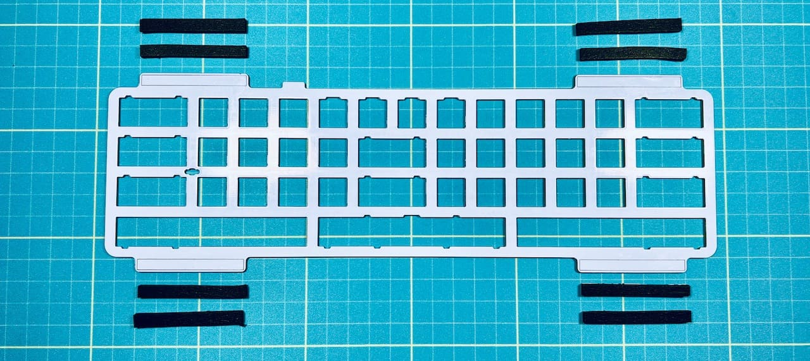
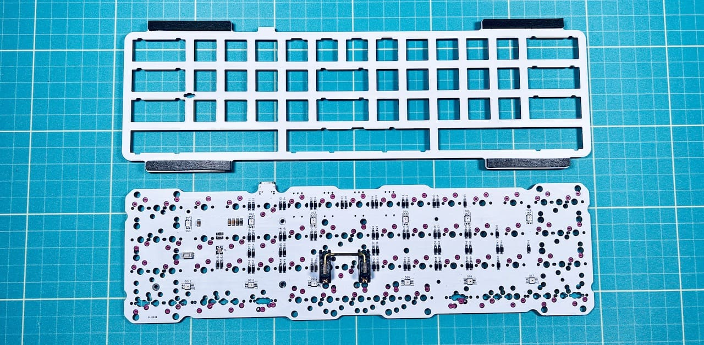
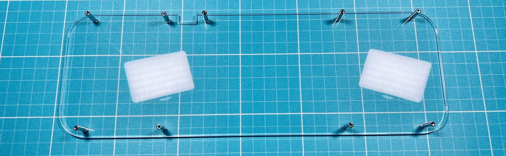
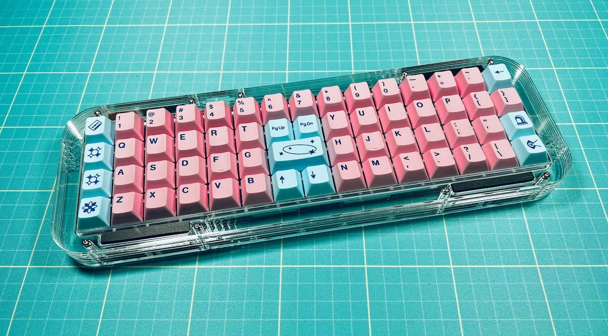

# On the 15 アクリル積層ガスケットマウントケース
- [ご注意](#ご注意)
- [キット内容](#キット内容)
- [組み立て](#組み立て)

## ご注意
- 組み立てにはOn the 15（[遊舎工房](https://shop.yushakobo.jp/products/4994)、[BOOTH](https://tarohayashi.booth.pm/items/3672079)）のメインボードが必要です。
- 自分で発注するとお好きな色のアクリル、ネジで制作可能です。

## キット内容
  
|部品名|数|入手先|
|-|-|-|
|アクリルプレート|[図面データ](data.md)|[遊舎工房](https://shop.yushakobo.jp/collections/services/products/lasercut)、[工房Emerge+](https://www.emergeplus.jp)等|
|トッププレート|[図面データ](data.md)|各種PCB製造業者|
|8mmM2ネジ|18|[遊舎工房](https://shop.yushakobo.jp/products/a0800n2?_pos=2&_sid=6d67644cd&_ss=r&variant=37665433026721)、[ヒロスギネット](https://www.hirosugi-net.co.jp/shop/g/g102178/)等|
|4x15mmスペーサー|9|[遊舎工房](https://shop.yushakobo.jp/products/a0800c2?_pos=1&_sid=19dbc8a58&_ss=r&variant=37665435484321)、[ヒロスギネット](https://www.hirosugi-net.co.jp/shop/g/g2404/)|
|ポロンスポンジシート|8|[モノタロウ](https://www.monotaro.com/p/1871/7195/)|
|予備|1|5mm幅に切ってお使いください|
|ゴム足|6|[遊舎工房](https://shop.yushakobo.jp/collections/all-keyboard-parts/products/a0800ur-01-6?variant=37665431060641)、100円ショップ、Amazon等|

### 必要なもの
  
詳細は[On the 15のビルドガイド](https://github.com/Taro-Hayashi/On-the-15/blob/main/README.md)をご覧ください
|部品名|||
|-|-|-|
|はんだ付け済みメインボード|キースイッチ|キーキャップ|

### 使用する工具
|||
|-|-|
|精密ドライバー|プラス|
|静電防止手袋|組み立て中に指紋が付くのを防げます。|
|アクリサンデー ポリケアF70|指紋を拭いたりホコリを付きにくくできます。|
|アクリサンデー 研磨剤|側面を磨いてツルツルにしたり、細かい傷を消すことができます。|

## 組み立て
 
トッププレートにポロンスポンジシートを貼り付けます。切断面に納得がいかない場合は予備から切り出してください。
  
キースイッチをトッププレートに取り付け、メインボードのソケットに差し込みます。
  
  
キーキャップを付けました。
  
 
アクリルケースはキットをご購入の場合は仮組みされています。発注した場合も一度ケースとして組み立てられるか確認すると安全です。 
プレートの順番がわからなくなった場合はこちらを参考にしてください。
 - [プレート一覧](plates.md)
  
表面のネジを外します。  
  
裏返してスペーサーごと底のプレートを抜き取ります。  
  
ネジを外して底のプレートからスペーサーを取り除いたら保護フィルムを剥がし、ふたたびネジでスペーサーを取り付けます。 
  
表裏があるので穴の位置に気をつけてください。  
  
保護フィルムを外しつつプレートを乗せていきます。  
  
  
  
  
3層目まで乗せたらトッププレートを乗せます。
  
1層目で挟み込み、ネジで止め、ゴム足を貼ったら完成です。
  
  
 

## 販売ページ
遊舎工房フリマで販売します。BOOTHへの在庫の追加は未定です。
- [BOOTH](https://tarohayashi.booth.pm/items/4144806)  

