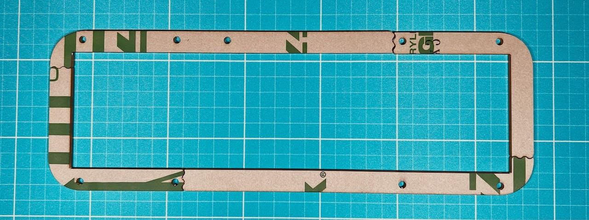

## プレート一覧
上から順です。表裏があります。  
### 1層目
一枚板で長方形に切り抜かれています。ネジ穴が小さいです。  
  
### 2層目
長方形に切り抜かれていて、4パーツに分かれています。  
別売りのパステルミドルプレートはこれの代わりに使います。 
   
### 3層目
4パーツに分かれています。  
トッププレート型の形に切り抜かれています。  
  
### 4層目
4パーツに分かれています。  
3層目との違いは接合部分の位置です。  
  
### 5層目
5パーツに分かれています。  
内側がメインボード型に切り抜かれていてUSB用の隙間（狭）があります。  
  
### 6層目
5パーツに分かれています。  
内側がメインボード型に切り抜かれていてUSB用の隙間（広）があります。  
  
### 7層目
一枚板でUSB用の隙間（狭）があります。  
  
